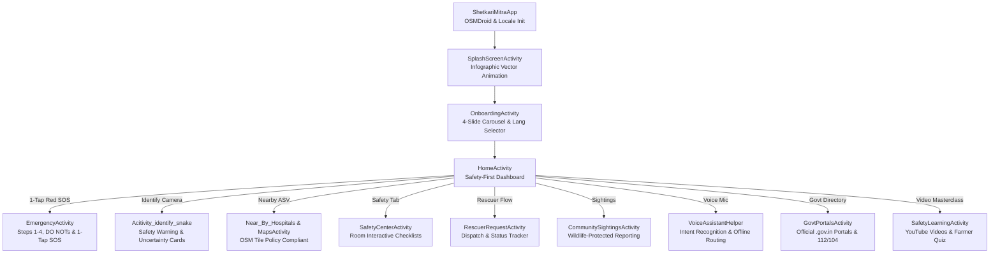

# Shetkari Mitra (शेतकरी मित्र) 🐍🌾
### *Snake Safety. Faster Help. Safer Communities.*

[](https://github.com/vishal-bhutekar21/Setkari-Mitra--Android-Application-)
[-blue?logo=android)](https://developer.android.com)
[](https://www.oracle.com/java/)
[]()
[-brightgreen?logo=openstreetmap)](https://www.openstreetmap.org)
[-purple)]()

**Shetkari Mitra** is an open-source, safety-first Android application purpose-built for farmers, rural communities, and agricultural workers in India (specifically Maharashtra). It provides rapid emergency assistance for snakebites, anti-snake venom (ASV) hospital navigation, certified snake rescuer (सर्पमित्र) dispatch, species visual identification, interactive safety checklists, government disaster portal access, and multi-lingual voice navigation.

---

## 🌟 Core Safety Principle

```
PREVENT  ➡️  IDENTIFY  ➡️  RESPOND  ➡️  GET HELP  ➡️  LEARN
```

---

## 🚀 Key Features & Architectural Modules



### 1. 🚨 Dedicated Emergency SOS Mode (`EmergencyActivity`)
- **4 Life-Saving Action Steps**: Step-by-step guidance designed for high-stress rural emergencies.
- **High-Contrast Red "AVOID THESE HARMFUL ACTIONS" Card**: Strict warnings against incisions, sucking venom, tourniquets, or consulting traditional quacks.
- **Persistent Emergency Action Bar**:
  - **108 / 112 Direct Ambulance Dialer**
  - **Nearby ASV Hospital Route Navigator**
  - **1-Tap Emergency SMS/WhatsApp GPS Dispatch** with live latitude, longitude, and formatted emergency distress message.

### 2. 🗺️ OpenStreetMap ASV Hospital & Rescuer Directory (`MapsActivity` & `Near_By_Hospitals`)
- **OSM Tile Policy Compliant Engine**: Custom compliant User-Agent (`ShetkariMitra-Android-Safety/2.0`), dedicated 100MB disk tile cache, and hardware acceleration (eliminates `osm.wiki/blocked` error).
- **Anti-Snake Venom (ASV) Hospital Locator**: Real-time distance calculation, address, contact person, and direct turn-by-turn navigation.
- **Certified Sarpmitra Directory**: Directory of certified rescuers across Jalna, Chh. Sambhajinagar, and surrounding Maharashtra districts.
- **Wildlife-Protected Community Sightings Map Layer**: Visualizes recent regional sightings with generalized approximate coordinates to protect sensitive species while keeping farmers informed.

### 3. 🐍 Uncertainty-Aware Snake Identification (`Acitivity_identify_snake`)
- **Mandatory Safe Distance Warning Banner**: Advises farmers never to approach or corner a snake for photographs.
- **Indicative Match Classification**: Displays *"Possible Match"*, confidence score, physical traits, venom status, and medical disclaimer.
- **Action Buttons**: Instant navigation to *"What Should I Do?"*, *"Find Rescuer"*, *"First Aid"*, and 1-tap WhatsApp photo sharing with certified herpetologists.

### 4. 📋 Interactive Safety Center & Room Checklists (`SafetyCenterActivity`)
- **Visual Safety Categories**: *Home Safety*, *Farm Safety*, *Monsoon Safety*, *Children Safety*, *Snake Prevention*.
- **Interactive Checklists**: Checkable safety measures (e.g. torch placement, footwear inspection, grass trimming) with real-time score calculation (e.g. *4 / 5 Completed*) and local SQLite persistence via **AndroidX Room**.

### 5. 🚑 Structured Rescuer Dispatch Workflow (`RescuerRequestActivity`)
- **Situation Selection**: *Inside Home*, *In Farm*, *Public Area*, *Other*.
- **Location Geocode Tagging**: Automatically captures location or landmark.
- **Real-Time Request Progression**: Live status tracking (*Request Sent $\rightarrow$ Accepted $\rightarrow$ On the Way $\rightarrow$ Resolved*).

### 6. 🏛️ Official Government & District Portals (`GovtPortalsActivity`)
- **Direct Directory of Verified Maharashtra Portals**:
  - **Jalna District Collectorate & Disaster Cell** (`jalna.gov.in`)
  - **Maharashtra Public Health Dept / Arogya Vibhag** (`arogya.maharashtra.gov.in` — ASV SOPs & Helpline 104)
  - **MahaForest Wildlife & Snake Rescue Portal** (`mahaforest.gov.in` — Helpline 1926)
  - **State Disaster Management Authority (SDMA)** (`sdma.maharashtra.gov.in` — Helpline 112)
  - **Chhatrapati Sambhajinagar District Portal** (`aurangabad.gov.in`)
- **1-Tap Secure Browser Launch** and 1-tap emergency helpline dialer.

### 7. 🎓 Safety Video Academy & Farmer Quiz (`SafetyLearningActivity`)
- **Doctor & Herpetologist Video Masterclasses**:
  - *The 'Big 4' Venomous Snakes of India (Identification)*
  - *Golden Hour First Aid Protocol (Doctor Demonstration)*
- **Interactive Farmer Safety Knowledge Quiz**: Instant interactive questions debunking tight tourniquets and traditional herbal myths, providing clear medical feedback.

### 8. 🎙️ Multi-Lingual Speech-to-Action Voice Assistant (`VoiceAssistantHelper`)
- Integrated microphone button in the top bar using Android's `RecognizerIntent`.
- Offline intent router supporting **English**, **मराठी**, and **हिंदी**:
  - *"I was bitten" / "चावला" / "काटा"* $\rightarrow$ Opens **Emergency Mode**
  - *"Find hospital" / "रुग्णालय" / "अस्पताल"* $\rightarrow$ Opens **Nearby ASV Hospitals**
  - *"Find rescuer" / "सर्पमित्र"* $\rightarrow$ Opens **Rescuer Database**
  - *"Identify snake" / "ओळख"* $\rightarrow$ Opens **Snake Identification**
  - *"First aid" / "प्रथमोपचार"* $\rightarrow$ Opens **First Aid Guidelines**
  - *"Safety checklist" / "सुरक्षा"* $\rightarrow$ Opens **Safety Center**

### 9. 🌐 Dynamic Multilingual Localization (`LocaleHelper`)
- Runtime in-app language switching for:
  - 🇬🇧 **English**
  - 🇮🇳 **मराठी (Marathi)**
  - 🇮🇳 **हिंदी (Hindi)**
- Contextual **Permission Education Dialogs** for Location, Camera, and Notifications before invoking system prompts.

---

## 🛠️ Technology Stack & Architecture

| Layer | Technologies / Libraries |
|---|---|
| **Language** | Java 8 / 11 |
| **Minimum SDK** | Android 8.0 (API 26) |
| **Target SDK** | Android 14.0 (API 34) |
| **UI Framework** | Material Design 3 (Material Components), Vector Drawables, ConstraintLayout, CoordinatorLayout |
| **Mapping Engine** | [OSMDroid](https://github.com/osmdroid/osmdroid) (OpenStreetMap SDK for Android) |
| **Location Services** | Google Play Services (`FusedLocationProviderClient`, `Geocoder`) |
| **Local Persistence** | AndroidX Room ORM with SQLite, SharedPreferences |
| **Speech Recognition** | Android `RecognizerIntent` / `SpeechRecognizer` |
| **Build System** | Gradle 8.0+ |

---

## 📂 Project Structure

```
Shetkari_Mitra/
├── app/
│   ├── src/
│   │   ├── main/
│   │   │   ├── java/com/example/Shetkari_Mitra/
│   │   │   │   ├── ShetkariMitraApp.java           # Global Application (OSMDroid & Locale Init)
│   │   │   │   ├── SplashScreenActivity.java       # Infographic animated splash
│   │   │   │   ├── OnboardingActivity.java         # 4-slide onboarding & language picker
│   │   │   │   ├── HomeActivity.java               # Safety-first dashboard & 5-tab navigation
│   │   │   │   ├── EmergencyActivity.java          # Dedicated high-contrast emergency mode
│   │   │   │   ├── Acitivity_identify_snake.java   # Uncertainty-aware snake identification
│   │   │   │   ├── MapsActivity.java               # OpenStreetMap with ASV, Rescuers & Sightings
│   │   │   │   ├── Near_By_Hospitals.java          # Nearby hospital directory
│   │   │   │   ├── RescuerDatabaseActivity.java    # Certified sarpmitra network
│   │   │   │   ├── RescuerRequestActivity.java     # Rescuer dispatch & live status tracker
│   │   │   │   ├── SafetyCenterActivity.java       # Interactive local safety checklists
│   │   │   │   ├── SafetyLearningActivity.java     # Video academy & interactive farmer quiz
│   │   │   │   ├── GovtPortalsActivity.java        # Official .gov.in portals directory
│   │   │   │   ├── CommunitySightingsActivity.java # Wildlife-protected regional sightings
│   │   │   │   ├── VoiceAssistantHelper.java       # Multi-lingual intent router
│   │   │   │   ├── LocaleHelper.java               # Dynamic runtime locale manager
│   │   │   │   ├── AppDatabase.java                # Room SQLite Database
│   │   │   │   ├── SafetyChecklistDao.java         # Safety checklist Room DAO
│   │   │   │   └── RescuerRequestDao.java          # Rescuer request Room DAO
│   │   │   ├── res/
│   │   │   │   ├── layout/                         # XML UI layouts
│   │   │   │   ├── drawable/                       # Vector assets & bold navigation icons
│   │   │   │   ├── values/                         # English strings & design tokens
│   │   │   │   ├── values-mr/                      # Marathi (मराठी) localization strings
│   │   │   │   └── values-hi/                      # Hindi (हिंदी) localization strings
│   │   │   └── AndroidManifest.xml
│   │   └── build.gradle
│   └── build.gradle
└── README.md
```

---

## 🔧 Installation & Build Instructions

### Prerequisites
- **Android Studio** Hedgehog / Iguana / Jellyfish (or Antigravity IDE)
- **Android SDK** API 26 through 34 installed
- **Java Development Kit (JDK)** 17 or higher

### Build Steps
1. Clone the repository:
   ```bash
   git clone https://github.com/vishal-bhutekar21/Setkari-Mitra--Android-Application-.git
   cd Setkari-Mitra--Android-Application-/Shetkari_Mitra
   ```
2. Build the Debug APK using Gradle wrapper:
   - **Windows**:
     ```powershell
     .\gradlew.bat assembleDebug
     ```
   - **Linux / macOS**:
     ```bash
     ./gradlew assembleDebug
     ```
3. Install on a connected physical device or emulator:
   ```bash
   adb install -r app/build/outputs/apk/debug/app-debug.apk
   ```

---

## 👨‍💻 Developer & Maintainer

**Vishal Bhutekar**
- GitHub: [@vishal-bhutekar21](https://github.com/vishal-bhutekar21)
- Project: **Shetkari Mitra Android Application**

---

## 📄 License
This project is licensed under the open-source **MIT License**.
All wildlife protection protocols comply with the **Wildlife Protection Act of India (1972)** and standard Maharashtra Forest Department rescue operating procedures.
